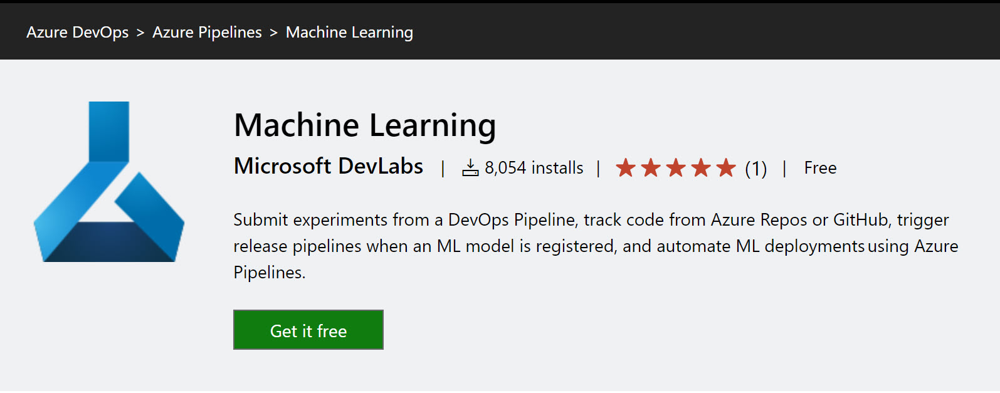
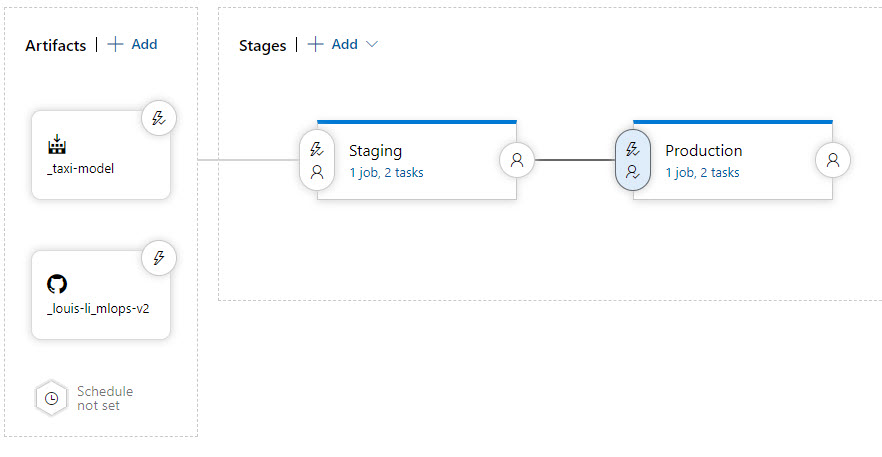
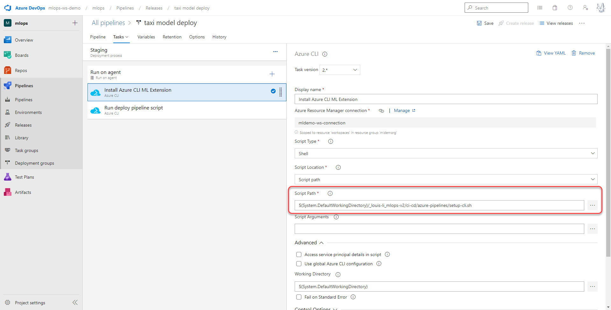
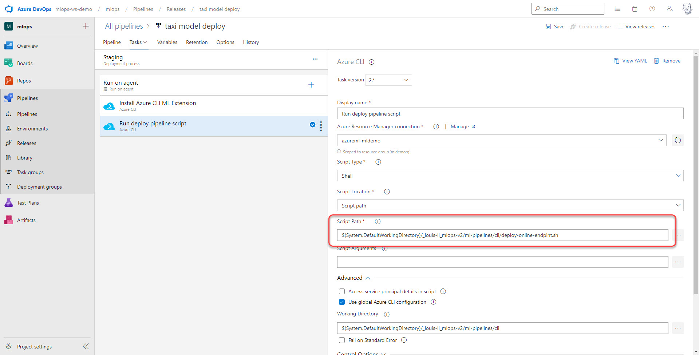
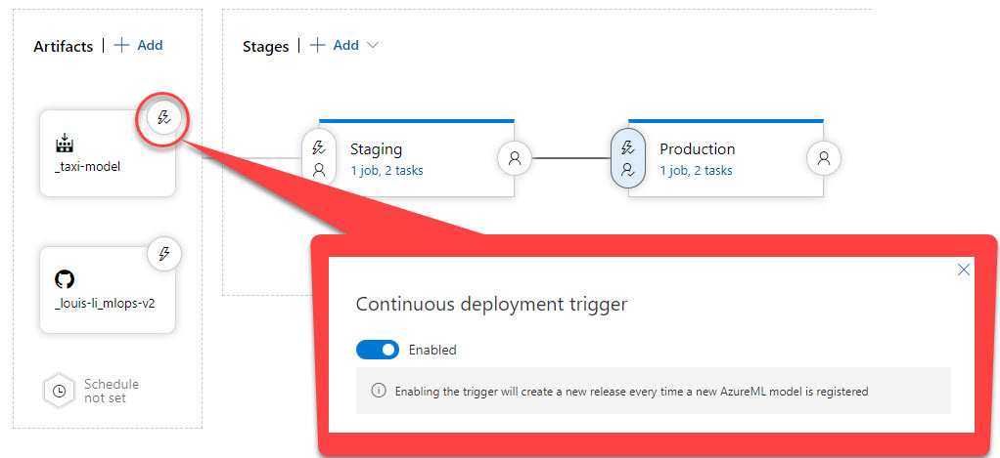
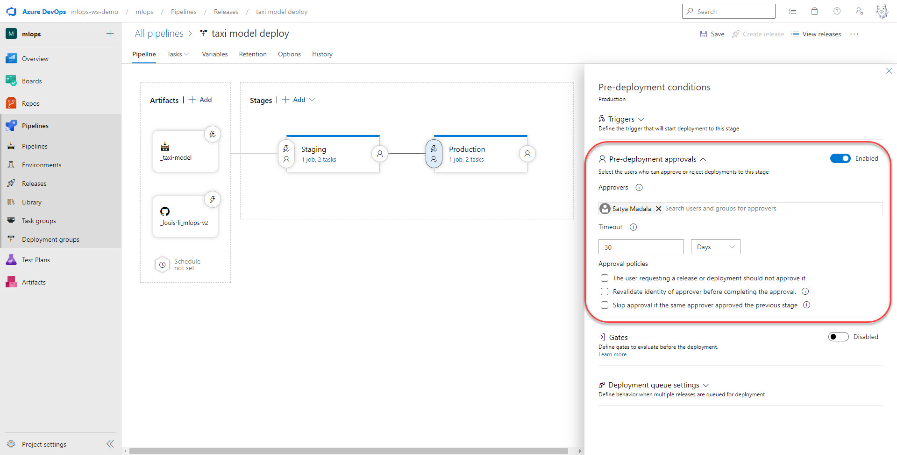

# Azure MLOps (v2) CI/CD Example

This is sample repo to create automated CI/CD process using Azure Pipelines or Github Actions.

## Creating CI/CD with Azure Pipelines

### Create CI using Azure Pipeline Build Pipeline
Following instructions to create CI pipeline for training:
<https://learn.microsoft.com/en-us/azure/machine-learning/how-to-devops-machine-learning>

### Create CD using Azure Pipeline Release Pipeline
1. Install Machine Learning for Azure Pipelines

2. Create a Release pipeline triggered by Azure Machine Learning Model Registry 
    2.1 Add following to your release pipeline: 
    - Azure Machine Learning Registry  
    - Inference Repo to Artifacts  
    - Add stages  
    
    2.2 Add Azure CLI task for preparing environment  
  
    2.3 Add Azure CLI task for model deployment
      
    2.4 Enable trigger - Continuous Deployment
      
    2.5 Predeployment Approal 
      

## Createing CD + CD with Github Actions

<https://learn.microsoft.com/en-us/azure/machine-learning/how-to-github-actions-machine-learning?tabs=userlevel>